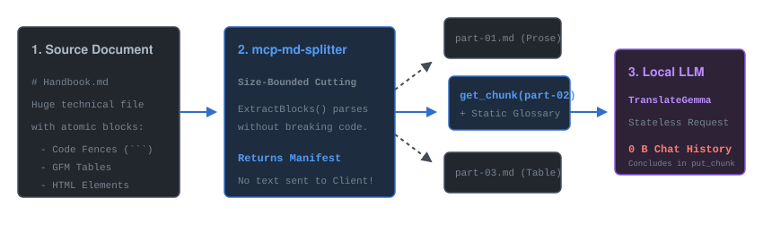
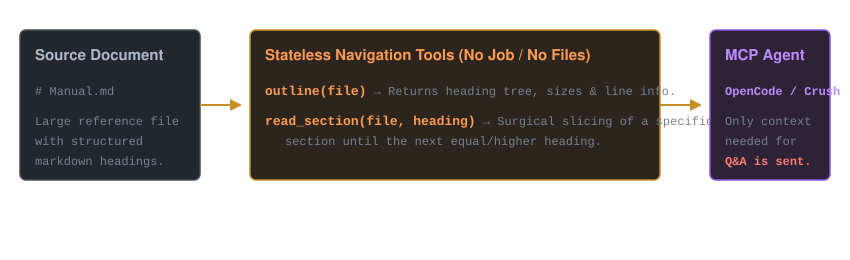

---
translation:
  tool: mdsplit
  version: 1.5.0
  url: "https://github.com/mlechner911/mdsplit"
  source: README.md
  source_sha256: 04c5e5b962e49303
  source_chars: 29365
  target_lang: zh
  model: "qwen3.5:35b"
  mode: block
  parts: 18/18
  translated: "2026-08-27T20:13:45Z"
  machine_translation: true
---


<sub>使用Nano Banana 2创建的插图2</sub>

# Markdown分割器

[](https://github.com/mlechner911/mdsplit/actions/workflows/ci.yml)
[](go.mod)
[](https://github.com/mlechner911/mdsplit/releases)
[](LICENSE)
[](#mcp-mode-default)

<sub>本工具机器翻译：[Deutsch](README.de.md) · [Español](README.es.md) · [Français](README.fr.md) · [中文](README.zh.md) — 每种语言均在文前注明其来源。</sub>

将Markdown文档拆分为大小受限的块，以确保其适合LLM翻译或处理。原子块（代码块边界、表格、列表、多行HTML）绝不会在块边界处拆分——只有完整的块会在块之间移动。

采用 Go 实现。六种运行时模式——拆分、合并、翻译、术语表、检查和大纲——以及一个 MCP（模型上下文协议）服务器，将相同的工作暴露为按块处理的**任务**工作流。



## 动机

使用本地模型翻译长 Markdown 文档时，这首先是一个上下文问题，其次才是语言问题。60 KB 的手册无法放入 8k-token 的窗口中，因此必须被拆分——而简单的拆分方式恰恰是最具破坏性的。每 N 个字符拆分一次会导致代码块边界被切断，一半在一段，另一半在下一段；模型会忠实地“翻译”这孤立的半截，重命名标识符，导致该代码块永远无法闭合。在空行处拆分会使表格丢失其标题行。仅在标题处拆分则会导致一个章节仅 200 字节，而下一个章节却长达 40 KB。

将整份**文件**交给模型并让其自行分块也无济于事：此时文件已处于上下文中，而这正是需要避免的情况。

因此，该工具在模型外部进行切割，基于两条规则：

1. **某些块是不可分割的。** 代码块边界、表格、带有其
   续行，HTML 元素。即使这意味着要破坏完整性，它们仍保持完整。
   通过规模预算——一个两倍大的块头是个不便，
   在栅栏中间结束的块是损坏。
2. **尺寸是一个目标，而非法律。** 切割先于标题落地，因此一个块
   从某个部分开始并将其整体携带。一个稍小的块，其
   自成一体的翻译效果优于从句子中间开始的完整版本。

MCP 侧遵循同样的关切。`split_markdown`返回一份清单——包含部分数量、大小和标题——而非文本。内容通过`get_chunk`逐部分获取，并通过`put_chunk`写回，因此无论源文件是 10 KB 还是 10 MB，上下文都保持扁平。

最后一步是返回路径。分块只有在可逆的情况下才是安全的，因此清单会在每个边界处记录空行间隙，并且合并结果会与源文件逐字节进行验证。如果往返检查对于未翻译的文档完全精确，则流水线没有静默丢失任何内容——翻译后的任何差异都是模型造成的，而非分块器所致。

专为 Crush](https://github.com/charmbracelet/crush) 驱动本地 Ollama 模型而构建，但其中没有任何内容专门针对两者中的任何一个。

## 功能

- **与章节对齐的块**：其大小是一个*软*预算。分割器倾向于
  在标题之前进行切割，而不是将块填满，因此一个块
  从某个部分开始并完整保留该部分。标题永远不会结束一个块。
- **原子块永远不会被拆分**，无论预算如何：代码块边界
  (任何信息字符串 — ` ```js 标题为"a.js" `, ` ``` go `, `~~~`, `````), GFM
  表格行组，带有其续项的列表项，以及多行 HTML
  元素。一个超出预算的不可分割块会获得自己的分块
  以及关于 stderr 的说明。
- **字节精确的往返检查**：`index.json`记录每个空行间隙
  块边界，因此合并会逐字节地重现源文件。唯一
  标准化在 `Canonical()` 中有记录：首尾空行
  被修剪，且仅包含空白的行变为空。缩进和硬
  换行符（两个尾随空格）得以保留。
- **命令行接口模式**：写入 `<name>-part-NN.md` 文件以及一个 `index.json` 清单（源文件、部分计数、有序块列表），位于源文件旁边。
- **合并模式**：`-merge -dir chunks/`通过清单重新组装块，并报告结果是否为字节相同、空白相同或存在差异。
- **MCP 任务工作流**：`split_markdown`返回的是清单，而非文档。
  内容通过 `get_chunk` / `put_chunk` 一次移动一个部分，因此上下文
  无论源文件有多大，它都保持不变——这正是其核心所在。
  针对小型本地模型运行此操作。

## 要求

- Go 1.25+
- 可选：[任务文件](https://taskfile.dev/) (`go install github.com/go-task/task/v3/cmd/task@latest`)
- 可选，用于翻译：任何与 OpenAI 兼容的端点——一个本地
  [Ollama](https://ollama.com/) 或 [LM Studio](https://lmstudio.ai/) 服务器，或
  OpenAI API。按进程配置，而非按请求；参见
  [翻译](#translation)。

## 构建与测试

```bash
# with Taskfile
task build     # -> bin/mcp-md-splitter
task test      # go test -v ./...
task vet
task check     # vet + test + build (CI-style)
task roundtrip # split the fixture, merge it back, fail unless byte-identical
task install   # go install -> ~/go/bin (global `mcp-md-splitter`)
task clean     # removes bin/ and chunks/

# or plain Go
go build -ldflags "-X main.version=$(cat VERSION)" -o bin/mcp-md-splitter ./cmd/mcp-md-splitter
go test ./...
```

## 用法

### CLI 模式

```bash
./bin/mcp-md-splitter -cli -file docs/integration.md -size 4000
./bin/mcp-md-splitter -cli -file docs/integration.md -size 4000 -target de
```

输出写入到与源文件相邻的 `chunks/` 目录中：

```
chunks/
├── integration-part-01.md
├── integration-part-02.md
├── integration-part-03.md
└── index.json          # Manifest: id, source_file, total_parts, size, target,
                        #           gaps[], parts[{part,file,chars,heading}]
```

### 合并模式

```bash
# reassemble via chunks/index.json
./bin/mcp-md-splitter -merge -dir chunks/
./bin/mcp-md-splitter -merge -dir chunks/ -out combined.md
```

结果写在源文件旁边，标记为 `<source>.merged`，或在部分被翻译时标记为 `<source>.<target>.md`。每个部分使用其编辑版本（如果存在），否则使用原始版本，因此即使运行未完成也能合并。

往返检查首先进行字节精确比较（`Canonical`），然后才进行宽容比较（`Normalize`），因此规范化不再能掩盖真实差异。它报告字节相同/仅空白符/不一致。

没有 `index.json`，所有 `*-part-NN.md` 文件将按字典序合并；若清单中缺少 `gaps`，则在每个边界处假设存在一个空行。

### MCP 模式（默认）

运行不带标志以提供 stdio MCP 服务器。这些工具构成一个**任务工作流**，因此小型本地模型无需持有整个文档：`split_markdown`将块写入磁盘并仅返回清单，然后内容逐部分移动。

| 工具 | 参数 | 返回 |
|---|---|---|
| `split_markdown` | `filePath`, `size` (8000), `target`, `outDir` | 仅清单 — `jobId`，各部分的尺寸和标题。**不是**内容。 |
| `get_chunk` | `jobId`, `part` | 该部分的文本（若存在则为编辑版） |
| `put_chunk` | `jobId`, `part`, `text` | 存储翻译的**部分**，报告进度和下一个开放的**部分** |
| `job_status` | `jobId` \| `chunksDir` | 进度和部件列表，无内容 |
| `merge_chunks` | `jobId` \| `chunksDir`, `out` | 重新组装；编辑的部分胜出，未触动的部分回退到原始状态 |
| `translate_chunk` | `jobId`, `part`, `language`, `mode` | 通过配置的端点翻译一个部分；仅返回状态行 |
| `build_glossary` | `jobId`, `language`, `terms` | 提议该文档的术语并撰写 `glossary.json`以供审查 |
| `outline` | `filePath` | 每个标题的大小都与其打开的节相匹配。**无文本**。无需任务 |
| `read_section` | `filePath`, `section` | 逐字一个部分，块保持完整。无需作业 |

一次翻译运行如下所示：

```
split_markdown(filePath="doc.md", size=2000, target="de")
  → jobId dfd9fa33cd, 11 Teile          (686 chars back, not 10 KB)
get_chunk(jobId, part=1) → translate → put_chunk(jobId, part=1, text=…)
  … repeat; put_chunk names the next open part each time …
merge_chunks(jobId) → doc.de.md
```

`put_chunk`从不触碰原始块，因此运行可以逐部分恢复、重做或合并未完成的部分。在未进行任何编辑的情况下，`merge_chunks`还会针对源文件验证字节精确的往返检查。

块落入 `chunks/` 紧邻源文件（可通过 `outDir` 覆盖）；`jobId` 是源文件路径与预算的稳定哈希值，因此使用相同预算重新分割同一文件将复用同一任务。

安装一次，然后向任何客户端注册命令——无需路径
(`go install` 位于 `~/go/bin`)：

```bash
go install github.com/mlechner911/mdsplit/cmd/mcp-md-splitter@latest
# from a checkout: task install
```

该仓库提供了一个项目本地的 `.mcp.json`，可为您自动完成此操作，因此从此目录（Crush、Claude Desktop、OpenCode 等）启动的客户端会自动识别并连接服务器：

```json
{
  "mcpServers": {
    "md-splitter": {
      "command": "mcp-md-splitter"
    }
  }
}
```

一个全局 `crushrc` 条目工作方式相同：`mcp add md-splitter --command mcp-md-splitter`。

## 翻译

配置端点后，拆分器可自行运行翻译，每个片段发出一个隔离的请求。它们之间不会累积任何内容，因此 10 MB 文档与 10 KB 文档在每一步的成本相同。

端点设置是**进程配置，而非工具参数**。通过工具调用传递的令牌会落入客户端的对话记录中，而由调用者选择的 URL 会在翻译后的文档携带注入指令的瞬间，将读取本地文件的工具转变为数据外泄通道。`MDSPLIT_LLM_TOKEN` 故意没有标志位，因此它也不会出现在进程列表中。

```json
{
  "mcpServers": {
    "md-splitter": {
      "command": "mcp-md-splitter",
      "env": {
        "MDSPLIT_LLM_URL":   "http://localhost:11434/v1",
        "MDSPLIT_LLM_MODEL": "qwen2.5-7b-instruct",
        "MDSPLIT_LLM_TOKEN": ""
      }
    }
  }
}
```

```bash
mcp-md-splitter -cli -file doc.md -size 3000 -target de
mcp-md-splitter -translate -dir chunks/ -lang de
mcp-md-splitter -merge -dir chunks/          # -> doc.de.md
```

Via MCP the same loop is `translate_chunk(jobId, part)` once per part; only a
one-line status comes back, never the text.

### 两种模式

| | `-mode block`（默认） | `-mode chunk` |
|---|---|---|
| 发送内容 | 仅散文片段 | 整个部分，代码被屏蔽 |
| 代码围栏、HTML | 永不传输 | 替换为 `⟦n⟧` 哨兵 |
| 项目符号、竖线、缩进 | 逐字复现 | 发送后检查 |
| 结构 | 保证 | 验证，错误则拒绝 |
| 每部分请求数 | 每个片段一个 | 一个 |
| 需要遵循指令的模型 | 否 | 是 |

块模式是默认设置，因为它使破坏变得不可能而非可检测：模型无法重写它从未接收到的代码。这也使得纯翻译模型可用——TranslateGemma 及其同类接受文本和语言对，没有通道可以输入“保留代码不变”之类的规则。

分块模式保持散文的连贯性，而这正是翻译质量所真正依赖的基础，因为词序是在整个从句层面决定的，而非在从句内部。首先屏蔽代码会移除典型技术 Markdown 中四分之一的输入，这决定了部分是否能适应小上下文窗口。

在这两种模式下，内联代码、URL、链接和图片目标、引用链接、脚注和内联 HTML 都会被屏蔽。图片的 *alt 文本* 故意保持可翻译：因为它是读者看到的正文，而路径则不是。

### 术语表

因为每个块都是独立翻译的，所以没有其他因素阻止模型在两个块中对同一术语进行两种不同的渲染。在本README上测量，一个术语在四种语言中出现了四种漂移：

| "代码围栏"变为 | |
|---|---|
| 西班牙语 | 代码分隔符 |
| 法语 | **un code** — 该术语被直接省略 |
| 中文 | 代码块 |
| 德语 | 代码段 |

```bash
mcp-md-splitter -glossary -dir chunks/ -lang es   # writes chunks/glossary.json
$EDITOR chunks/glossary.json                      # ← the point of the exercise
mcp-md-splitter -translate -dir chunks/ -lang es  # picks it up automatically
```

候选项是在**没有模型**的情况下找到的：在多个块中重复出现的单词和短语，并且也出现在文档中的代码或标识符内——“块”是指一行中的散文和下一行中的 `chunks/`。只有围栏内的标识符形状的令牌才被计入，因为围栏块中包含大量注释和 JSON 值中的英文，而统计这些内容会使"without"和"returns"看起来像技术术语。

它们随后在**一次**请求中完成翻译，而非每个块单独处理。逐块处理会将脆弱的结构化输出与宝贵的输出绑定——JSON 解析失败将导致翻译也失败——并且会使术语表依赖于块的处理顺序。

术语表是在翻译之前构建的，随后即被冻结。在翻译过程中扩展术语表会导致最早完成的部分使用的是空白的术语表，而最后完成的部分则拥有完整的术语表，这将把本应消除的不一致性固化到最先完成的部分中，并使得单个部分无法独立重做。

返回为句子的值会被拒绝而非存储。这并非表面问题：每个条目都会被注入到所有提及该术语的提示中，作为 `term = value` 出现，因此其中的句子会引导翻译方向而非使其更精准。与 7B 模型相比，`chunk starts` 返回了 *"un bloque que comienza en mitad de una fence es dañino."*

只有当术语实际出现在某个块中时，该条目才会随其发送，因此一个包含 200 个条目的术语表不会使每个提示膨胀。

`glossary.json` 应被编辑。“Interface = Schnittstelle"是一个决定，而非事实，这也是管道中纠正该问题的最经济点——在此处花费几分钟胜过重读十一个已翻译的片段。

#### 源语言

候选提取假设**源文件**为英文，而不仅限于提示中。其停用词列表为英文，并通过按空格分割来查找单词。传递 `-source-lang` 以表示其他情况；此时工具会告知您预期结果，而不是静默返回一个由冠词和介词组成的列表：

| 源 | 发生什么 |
|---|---|
| 英语（默认） | 提取器构建和测量的内容 |
| 德语、西班牙语、法语…… | 可行，但发出警告：功能词将出现在候选项中，需要删除。 |
| 中文、日文、韩文、泰文 | 拒绝——没有空格可供拆分，因此请手动编写术语表 |

该语言对记录在 `glossary.json` 中为 `source_lang` / `target_lang`，因为术语表仅对其所构建的语言对有效。

翻译本身没有这样的限制：`-source-lang` 到达提示模板，块模式结构保证在任何语言下都成立。只有术语提取是英语形状的。

### 规定请求格式的模型

翻译模型通常希望请求以特定方式呈现。
`zongwei/gemma3-translator`期望`Translate from English to German: <text>`
并且没有其他方法学习目标语言——纯文本不包含任何信息。

```bash
mcp-md-splitter -translate -dir chunks/ -lang de \
  -llm-model zongwei/gemma3-translator:1b -llm-user-template gemma3-translator
```

`-llm-user-template` 接受具有相同字段的 Go 模板，或简写形式：`gemma3-translator` 对应上述格式，`translategemma` 则作为纯用户消息使用 TranslateGemma 的自有指令。当设置该参数时，**不会发送系统消息**：由调用方自行构建消息，并决定规则是否应包含其中。这正是拥有内置系统提示的模型得以使用的关键——若我们发送系统消息，将会覆盖其原有设定。

同一模型可能需要其中一种机制，具体取决于由谁提供服务。TranslateGemma 的聊天模板会拒绝 LM Studio 中所有 OpenAI 形状的请求，因此在那里需要 `-llm-transport completions -llm-template
translategemma`。而 Ollama 的文档将指令作为调用方的任务进行包装，因此在那里 `-llm-user-template translategemma` 就足够了。两者渲染的文本相同，包括其模型卡指出的段落前的两个空行。

### 无法接受我们请求的聊天模板的模型

某些模型附带了 OpenAI 兼容层无法满足的聊天模板。TranslateGemma 就是这样一个例子：它直接拒绝系统角色（“对话必须以用户提示开始”），并要求用户内容为包含 `source_lang_code` 和 `target_lang_code` 的映射——这些字段在模板处理之前就会被 OpenAI 模式剥离。所有变体均返回 HTTP 400。

其模板最终构建的是普通英文散文，而非异质的控制令牌，因此在此处渲染回合而非在服务器上渲染，便避开了整个问题：

```bash
export MDSPLIT_LLM_TRANSPORT=completions
export MDSPLIT_LLM_TEMPLATE='<start_of_turn>user
You are a professional English (en) to German (de) translator. Produce only the
German translation, without any additional explanations or commentary. Please
translate the following English text into German:


{{.User}}<end_of_turn>
<start_of_turn>model
'
```

该模板是一个包含 `.System`、`.User`、`.SourceLang`、`.TargetLang`、`.SourceLangName` 和 `.TargetLangName` 的 Go 模板，因此一个配置即可覆盖所有语言对；`-llm-template translategemma` 是上述内容的简写，而 `MDSPLIT_LLM_STOP` 用于设置停止序列（默认值为 `<end_of_turn>`）。

块模式是这里的正确伴侣——一个仅接受语言对而无需其他输入的模型，没有渠道来执行“保持代码不变”这类规则，因此结构必须得到保证而非请求。

**没有指令通道的模型也无法使用术语表。** 这就是需要权衡的取舍：一个专门用于翻译的模型通常能更好地翻译句子，但它无法被告知在整个手册中*Fence*一词必须统一译为某个特定方式。在长文档中，术语的一致性往往比任何单个句子的质量更为重要，因此，一个遵循指令且拥有已审核术语表的通用模型，往往会胜过在缺乏指导的情况下工作的更优秀的翻译模型。

### 来源与时效性

每次拆分都会记录其来源，即 `index.json`，以及它是否曾被翻译：

```json
"provenance": {
  "tool": "mdsplit",
  "version": "1.3.0",
  "url": "https://github.com/mlechner911/mdsplit",
  "source": "doc.md",
  "source_sha256": "4efd5dc5da924339",
  "source_chars": 10236,
  "target_lang": "de",
  "model": "translategemma-4b-it",
  "mode": "block",
  "translated": "2026-08-27T14:23:11Z",
  "machine_translation": true
}
```

`source_sha256`是真正发挥作用的字段。大小和日期具有信息量；哈希值则让后续运行能够回答维护文档时实际至关重要的问题：

```bash
mcp-md-splitter -check -dir chunks/
# source: CHANGED since the split - re-split and retranslate   (exit 1)
```

一份已静默过期的翻译比一份明显缺失的翻译更糟，而流水线中的其他任何环节都不会注意到。

`-merge -stamp` 此外还将记录写入文档自身的 YAML 前置元数据中，以便在需要由*人*查看时呈现——尤其是`machine_translation: true`，因为机器翻译若无人工介入，其外观与某人撰写并审核的内容完全一致。

它从不简单地前置。一个已包含前元数据的文档若被第二个 `---` 块处理，将会被破坏，因为原始的前元数据将不再作为元数据，而变为内容；现有块会就地编辑，重复盖戳会替换记录而非复制它。端点 URL 故意不予记录：模型名称是溯源信息，内部地址则是泄露。

两个值得了解的后果。往返检查针对的是*未盖章*的文本，否则在首次盖章后它将永远报告“存在差异”。时间戳使得合并操作不具备幂等性，因此按调度重建的文档即使内容未变，每次运行也会显示差异——这就是为什么盖章是可选的，而哈希值而非日期才是承载负载的字段。

### 存储前检查什么

- 每个哨兵必须恰好返回一次。指示模型保留
  它们是礼貌；计数是机制。
- `finish_reason`必须为`stop`。截断的回复会无声地丢失文本，这
  是整个工具存在要防止的失败。
- 回复必须具有源的相同结构：相同的块类型以相同的顺序排列。
  顺序，代码块边界按字节完全相同，标题级别和表格行数保持一致。
  散文可能会完全改变——否则检查对……将毫无用处。
  翻译。

任何不满足这些条件的部分都不会被存储，并保持打开状态，因此重新运行时会重试这些部分。原始块永远不会被覆盖。

## 阅读而非处理

]

上述工具旨在解决“在不超出上下文的情况下处理整个文档”的问题。`outline`和`read_section`则解决了另一半问题：“无需阅读全部内容即可从该文档中作答”。两者基于相同的原语——安全地切割 Markdown 并使各部分可寻址，只是针对不同的问题。

```bash
mcp-md-splitter -outline -file README.md
#      1  22841  Markdown Splitter
#      9   2133    Motivation
#    194  10554    Translation
#    231   1301      Two modes
#    257   3425      Glossary
#    ...
mcp-md-splitter -section "Two modes" -file README.md
```

阅读此 README 的概要大约需要 700 个字符；“两种模式”部分为 1301。关于模式的某个问题只需 2 KB 即可回答，而非 23 KB——所示大小涵盖整个部分及其子部分，而这正是决定阅读是否负担得起的关键。

这两个工具都不需要任务：不写入任何块，没有清单，也没有 `jobId`。该装置用于处理整个文档；查找某项内容则完全不需要它。

**章节不是块。** 块遵循字节预算，章节遵循大纲：`## Usage` 跨越多个块，而短章节则与邻居共享一个块。`read_section` 返回标题及其下的所有内容，直到遇到相同或更浅层级的下一个标题——因此代码块边界每次都会完整返回。

按标题或路径（`"Usage > CLI"`）定位一个章节，当同一标题出现多次时。遇到歧义标题时，将列出候选项并拒绝该请求，而非进行猜测。

与基于嵌入的检索服务器的区别在于，这是**精确而非相似**的：您获得的是文档自身定义的章节，无需构建索引，无需保持同步，也不存在从块中间开始的窗口。

## 告诉您的代理如何使用它

仅注册服务器是不够的。工具描述说明了每个工具的功能，但模型仅在已决定调用某个工具时才会读取该工具的描述——因此排序规则来得太晚。请将此内容放入项目的 `AGENTS.md`、`CLAUDE.md` 或系统提示中：

```markdown
## Markdown documents

The `md-splitter` MCP server is available. Use it instead of reading Markdown
files directly.

- **Looking something up:** call `outline(filePath)` first, then
  `read_section` for the one section you need. Do not read a whole document
  to answer a question about part of it.
- **Translating or rewriting:** `split_markdown` → `build_glossary` once →
  `translate_chunk` per part → `merge_chunks`. Never read the document into
  the conversation first; that is the cost the tool exists to avoid.
- **Never paste a chunk's text into a message.** `put_chunk` and
  `translate_chunk` write to disk. The text is supposed to travel from file to
  model and back without passing through the conversation.
- **A rejected part is not a failure to work around.** It was not stored, so
  the document is intact. Call `translate_chunk` again for that part; the
  others are unaffected.
- **Do not loop `get_chunk` over every part.** Holding all of them at once is
  the situation the split was made to prevent.
```

最后那条规则值得保留。将分块工具交给模型后，它往往会获取每个分块并在其自身上下文中重新组装，这比直接读取文件成本更高——工具被使用了，但其目的也在同一时刻被挫败。

端点设置应放在 `.mcp.json` 下的 `env` 中，绝不应出现在提示词里：模型无法传递它从未接收过的令牌，这正是关键所在。

请注意，此仓库自身的 `AGENTS.md` 是一份不同的文档——它简要介绍了正在处理拆分器的代理，而非使用它的代理。

## 项目结构

标准 Go `cmd`/`internal` 布局：

```
.
├── .mcp.json                     # MCP client registration (md-splitter)
├── cmd/mcp-md-splitter/          # entrypoint
│   ├── main.go                   # flag parsing (cli / merge / mcp)
│   ├── cli.go                    # CLI export mode
│   ├── merge.go                  # Merge mode (-merge -dir …)
│   ├── mcp.go                    # MCP stdio server (6 tools)
│   └── translate.go              # -translate CLI mode
├── internal/job/                 # manifest, chunk files, jobId registry
├── internal/llm/                 # OpenAI-compatible chat client
├── internal/translate/           # block/chunk modes, placeholder protection
├── internal/split/               # splitter library (pure string functions)
│   ├── block.go                  # Block{Text,Gap,Kind,Level} + render helpers
│   ├── html.go                   # HTML block detection helpers
│   ├── extract.go                # ExtractBlocks (atomic-block parser)
│   ├── pack.go                   # groupBlocks, packRanges, SplitDoc, SplitFile
│   ├── join.go                   # Canonical, Normalize, JoinGaps, MergeFilesGaps
│   └── *_test.go                 # unit tests + byte-exact round-trip corpus
├── Taskfile.yaml                 # task build/test/vet/check/roundtrip/install/clean
├── VERSION                       # 1.3.0
└── testdata/sample.md            # a real README, used as a fixture
```

Pipeline: `ExtractBlocks(content) []Block` parses Markdown into atomic blocks —
each carrying its exact text, the blank-line `Gap` that followed it, and its
`Kind`. `groupBlocks` then bonds what must not be separated (blocks with no
blank line between them; a heading and its section). `packRanges` fills chunks
from those groups, preferring a cut before a heading. `SplitDoc(content, max)`
returns `Doc{Chunks, Gaps}`; `JoinGaps(chunks, gaps)` is the exact inverse.

## 开发说明

- **用户或模型读取的所有内容均为英文**：CLI 输出、错误
  消息、标志帮助和 MCP 工具描述。代码注释和测试
  失败消息是德语——这种拆分是刻意为之，因此请保留。
- 没有 Markdown AST 库。解析器是逐行设计的，因为一个 AST 会
  必须降低回源文件以进行切割，并保留源字节
  精确性是往返契约依赖的唯一要素。
- `TestRoundtrip_ProjectDocs` 在仓库中的每个 `*.md` 上运行拆分器。
  在三个预算上运行根节点并断言字节精确性——最便宜的真实语料库
  无需离开仓库即可使用。

## 持续集成

[`.github/workflows/ci.yml`](.github/workflows/ci.yml)在每次推送时运行：
`gofmt`/`go vet`/`go mod tidy`各一次，分别在 Linux、macOS 和 Windows 上运行测试套件
（拆分器主要处理路径，任务注册表位于
`os.UserCacheDir()`），以及一个往返检查任务，该任务在三个预算下拆分并合并仓库中的每个 Markdown 文件，除非每个文件都逐字节相同，否则将失败。

## 许可证

MIT © 2026 Michael Lechner — 参见 [LICENSE](LICENSE)。
